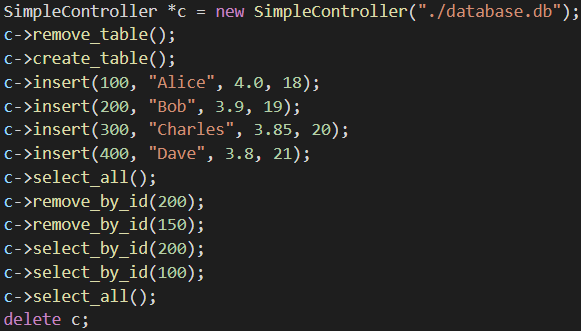
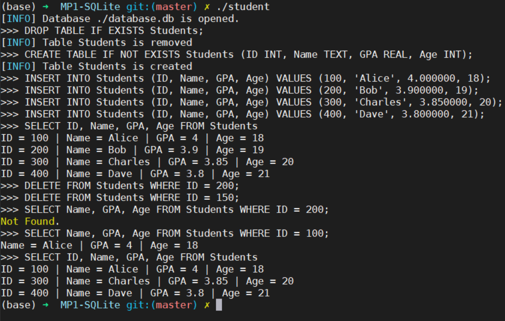

# Machine Problem 1

## Requirement

- Write a program in C/C++ with the following functions:
    - Connect to/Create a SQLite database instance on a local file, which contains a table with 4 columns (ID, Name, GPA, Age)
    - Add a student to the table
    - Remove a student from the table
    - Given student ID, find the name of the student and his GPA and age
    - Close the database instance

## How to Run the Code

```bash
make
./student
```

## Test

- Test Case



- Output



- Explanation
    - Initially, we clear the table Student by dropping and creating it.
    - In the four INSERT operations, Four students are added.
    - In the two DELETE operations, #200 is deleted and #150 is ignored since there is no such student.
    - In the two SELECT operations, #200 is not in the table and #100 is Alice.
    - Finally, there are three students left. And the destructor is called followed by exiting.