# Machine Problem 2

## Requirement

Write a program, supporting the following functions:

- Connect to a remote relational database server that contains the following tables:
    - A **student** table containing 4 columns: (ID, Name, Age, Dept)
    - A **course** table containing 6 columns: (CourseID, CourseName, Capacity, RemainCapacity, CreditHours, Requirement), the data type of Requirement column is xml, you can specify things like prerequisite course or department limitation
    - A **course registration** table containing two foreign key attributes and a grade attribute: (StudentID, CourseID, Grade)
- Insert tuples into student & course table
- Remove tuples from student & course table
- Look up the number of students enrolled in a course
- Check whether a student satisfies the requirement of a course
- Register a student to a course, reject this operation if the course is already at capacity limit or the student cannot register due to unmet requirements (use transaction)
- Remove a student from a course (use transaction)
- Update the capacity of a course, reject this operation if the number of students already enrolled exceeds the new capacity (use transaction)
- Retrieve the list of courses a student have attended in the past
- Retrieve all the course failure records – all the <student, course> pair that the student failed to pass the course (grade < 60)
- Update the grade of a student in a course
- Compute the GPA of a student
- Compute the average grade of students in a course

## Assumptions
- "delete student" can only be called when the student does not have any course.

- "delete course" can only be called when the course does not have any student.

- Course A having a prerequisite course B means a student can register course A only if the student have gotten the grade of course B (We do not care about the student's grade).

- "remove a student from course" takes effect only if the student does not get the grade. The reason of this design is that otherwise the prerequisite requirement may break.

- Grade Point calculates according to the following rule,
    $$
    GP(g) = \left\{\begin{array}{ll}
    4.0, &90 \leq g \leq 100 \\
    3.0, &80 \leq g < 90 \\
    2.0, &70 \leq g < 80 \\
    1.0, &60 \leq g < 70 \\
    0.0, &0 \leq g < 60
    \end{array}\right.
    $$
    

## Usage

```bash
python run.py
```

### Remarks

- To run the code, you need to install `pyodbc` package.
- If you run this program on a machine where SQL Server is not installed, please make sure that you have installed an **ODBC driver**.

- If you use SQL Server on a remote/virtual machine, please open TCP/IP protocol switch, and check your port. 

### XML Schema

The attribute Requirement  in table Course is in XML format. You need to make sure that the xml string you inserted satisfies the following XML schema.

```xml
<xs:element name="Req">
  <xs:complexType>
    <xs:sequence>
      <xs:element name="Pre" type="xs:int" minOccurs="0" maxOccurs="unbounded"/>
      <xs:element name="Dept" type="xs:string" minOccurs="0" maxOccurs="1"/>
    </xs:sequence>
  </xs:complexType>
</xs:element>
```

## Result

### Part 1

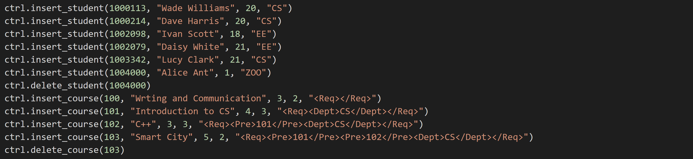

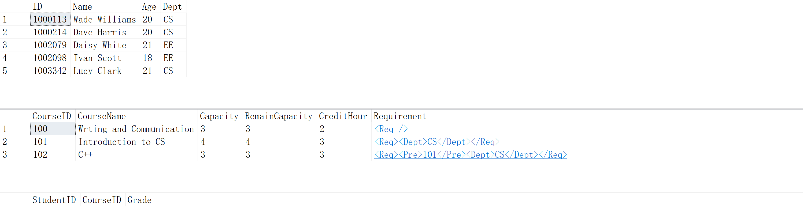

### Part 2

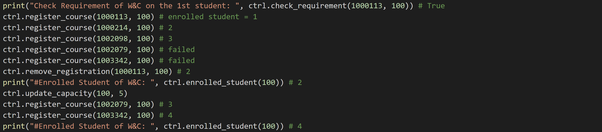

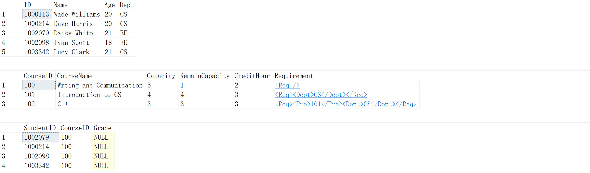

### Part 3

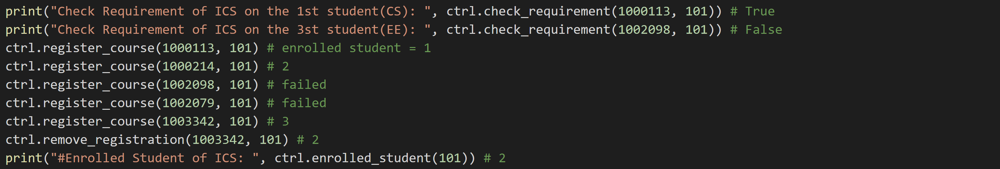

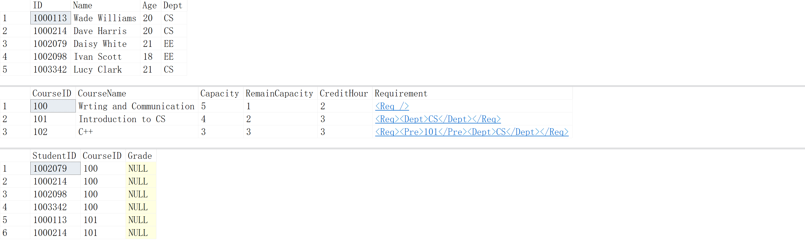

### Part 4

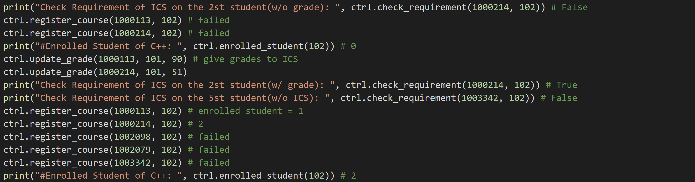

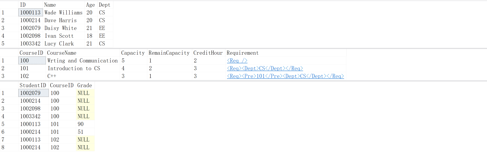

### Part 5

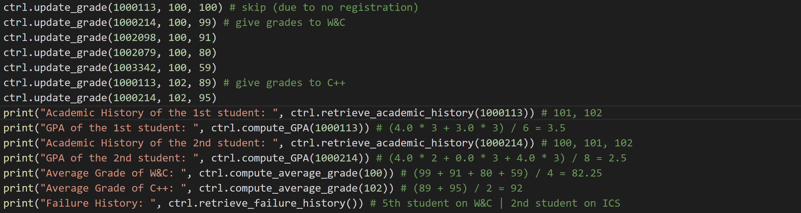

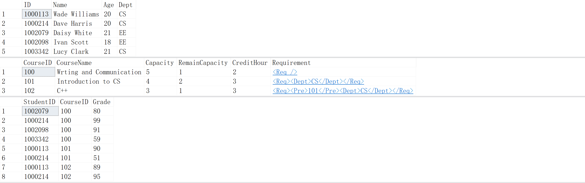

### Output in Terminal

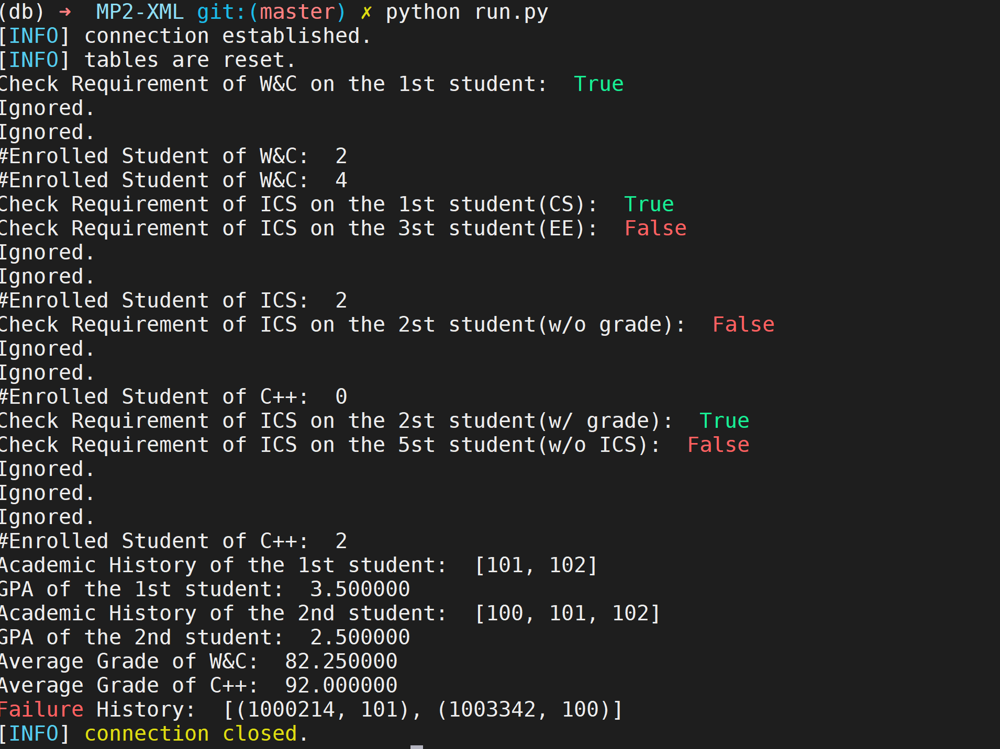